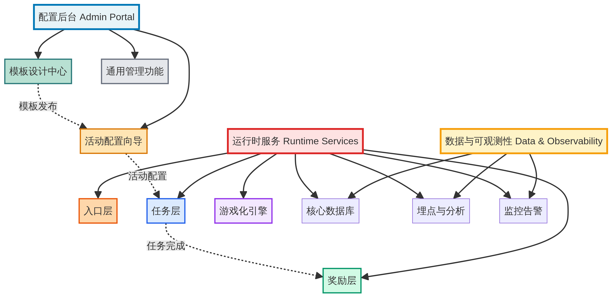
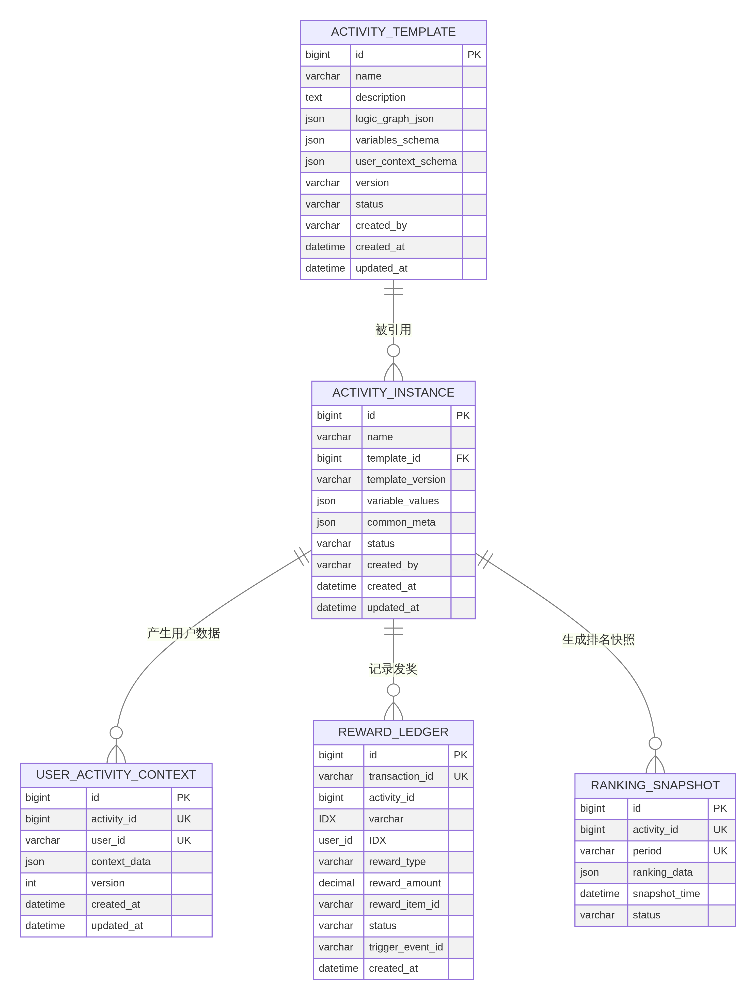
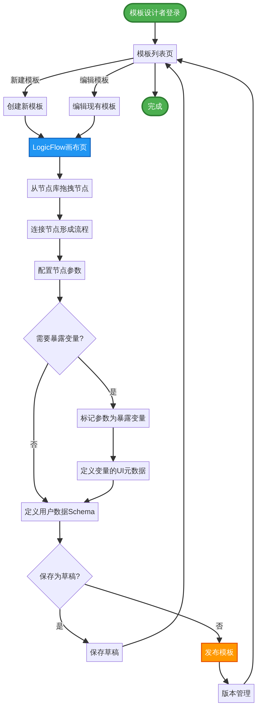
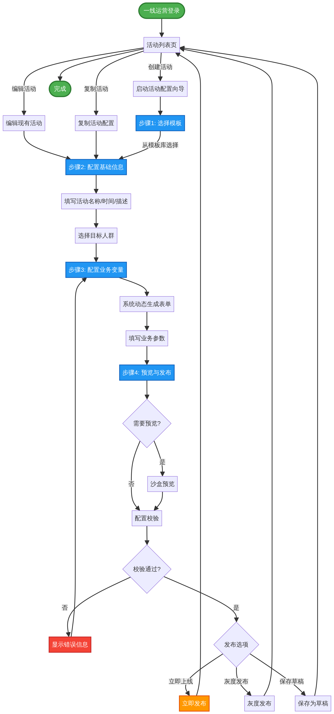

# XP通用活动平台产品设计文档

**版本:** 1.0
**日期:** 2026年1月19日
**作者:** Manus AI

---

## 1. 产品功能架构

基于PRD v2.0的核心设计理念，XP通用活动平台的功能架构遵循“前台配置、后台运行、数据支撑”的总体思路，划分为三大核心模块：**配置后台 (Admin Portal)**、**运行时服务 (Runtime Services)** 和 **数据与可观测性 (Data & Observability)**。该架构旨在实现运营与研发的关注点分离，确保平台的高效、稳定与可扩展性。

### 1.1 配置后台 (Admin Portal)

配置后台是运营人员与平台交互的核心界面，完全围绕“双层配置架构”构建，旨在平衡灵活性与易用性。

- **模板设计中心 (Template Designer)** - *(面向高阶用户/研发)*
    - **可视化流程编排 (LogicFlow)**
        - **节点库管理**: 提供标准化的事件(E)、条件(C)、动作(A)原子节点库。
        - **画布功能**: 支持节点的拖拽、连接、配置，形成活动逻辑的有向无环图 (DAG)。
        - **逻辑规则**: 支持串行、并行、分支等多种流程控制逻辑。
    - **变量暴露配置**
        - **参数映射**: 支持将画布中节点的内部参数（如金额阈值）标记为“暴露变量”。
        - **变量元数据定义**: 为每个暴露变量定义其在前端的展示名称、控件类型、校验规则等，形成动态表单的Schema。
    - **模板版本管理**
        - **版本控制**: 支持模板的版本创建、迭代与回滚（如 v1.0, v1.1）。
        - **状态管理**: 支持模板的“草稿”、“已发布”、“已归档”等状态流转。

- **活动配置向导 (Activity Creator)** - *(面向一线运营)*
    - **模板市场**: 提供已发布的活动模板列表，支持搜索和筛选。
    - **活动创建流程 (Wizard)**
        - **模板选择**: 从模板库中选择一个模板作为活动基础。
        - **基础信息配置**: 填写活动名称、周期、描述等通用信息。
        - **动态表单渲染**: 根据所选模板的“变量暴露Schema”自动生成配置表单。
        - **变量值填充**: 运营人员通过简单的“填空”方式完成活动业务参数的配置。
    - **活动实例管理**
        - **生命周期管理**: 支持活动的创建、编辑、复制、上线、下线、归档。
        - **版本与发布**: 支持活动配置的版本冻结、一键发布、灰度发布与快速回滚。

- **通用管理与支撑功能**
    - **预览与校验**
        - **沙盒预览**: 提供模拟环境，输入用户ID即可预览该用户视角下的活动状态。
        - **配置预校验**: 在发布前对活动配置进行强制校验，阻断明显错误。
    - **审计日志**: 记录所有关键操作（谁、何时、对何活动/模板、做了何种修改）。
    - **数据看板**: 提供活动核心指标（曝光、参与、ROI等）的可视化分析图表。

### 1.2 运行时服务 (Runtime Services)

运行时服务是线上实时处理用户请求和业务逻辑的后端服务集群，严格遵循“三层解耦架构”。

- **入口层 (Entry Layer)**
    - **入口决策服务**: 核心功能是决定“谁”在“什么时地”看到“什么样”的活动入口。
        - **人群定向**: 基于用户画像、标签、行为数据进行目标人群筛选。
        - **频次控制**: 控制活动入口对单个用户的展示频率。
        - **A/B实验分流**: 支持按比例将用户分配至不同活动版本或素材。
    - **素材与渲染服务**: 管理活动入口的素材（Banner/弹窗/浮窗），并根据决策结果进行展示。

- **任务层 (Task Layer)**
    - **事件总线 (Event Bus)**: 订阅并消费来自上游业务系统（如交易、用户中心）的核心业务事件。
    - **任务引擎 (Task Engine)**
        - **LogicFlow解释器**: 核心组件，负责加载并执行活动模板中定义的ECA逻辑图。
        - **进度计算**: 根据事件数据和活动规则，实时或准实时计算用户任务进度。
        - **状态判定**: 判定任务是否完成、失败或过期。
        - **周期与重置**: 管理周期性任务的进度重置逻辑。
    - **竞赛/榜单引擎**: 任务层的特化引擎。
        - **计分与排名**: 根据配置的计分规则实时更新用户排名。
        - **结算与快照**: 在竞赛周期结束时，生成不可变的排名快照用于派奖。

- **奖励层 (Reward Layer)**
    - **奖励计算服务**: 根据活动配置计算用户应得的奖励内容和数量。
    - **奖励发放服务**: 核心资金出口，负责调用下游渠道（钱包/卡券中心）执行发放。
        - **发放机制**: 支持自动发放和手动领取两种模式。
    - **预算与风控服务**
        - **预算校验**: 在发奖前检查活动总预算、小时预算、用户限额是否充足。
        - **库存管理**: 管理有限数量的奖品（如实物、特定面额券）的库存。
        - **风控检查**: 对接风控系统，在关键节点进行黑名单、地区、设备等校验。
    - **补偿与追回**: 提供后台接口，支持客服手动补偿发奖或对异常发放进行追回。

- **游戏化引擎 (Gamification Engine)**
    - **签到服务**: 管理用户的每日/连续签到状态。
    - **抽奖服务**: 提供转盘、九宫格等抽奖逻辑的通用实现。
    - **积分/等级服务**: 管理用户的积分账户和等级成长体系。
    - **成就/徽章服务**: 记录和展示用户获得的荣誉徽章。

### 1.3 数据与可观测性 (Data & Observability)

该模块是支撑平台稳定运行和效果分析的数据基础设施。

- **数据模型与存储**
    - **核心数据库**: 存储平台运行所需的核心数据，包括模板、活动实例、用户进度、发奖账本等。
    - **动态数据存储**: 采用JSON格式存储与活动类型相关的动态用户数据（如积分、任务状态）。

- **数据采集与分析**
    - **埋点SDK**: 提供标准化的前端和后端埋点SDK。
    - **数据仓库 (DWH)**: 存储和处理埋点数据，形成用户行为漏斗。
    - **BI报表**: 对接BI系统，为运营提供多维度的数据分析报表。

- **可观测性体系**
    - **日志服务 (Logging)**: 收集所有服务的结构化日志，便于问题排查。
    - **监控服务 (Monitoring)**: 监控系统核心指标（如接口错误率、延迟、预算消耗）。
    - **告警服务 (Alerting)**: 在关键指标异常时，通过多种渠道（短信、电话、IM）发送告警。

## 2. 信息架构与数据模型

信息架构的核心在于清晰地定义数据的组织、存储与关联方式。XP通用活动平台的数据模型严格遵循“模板与实例分离”、“静态与动态分离”的设计原则，以支撑高度灵活的业务需求。

### 2.1 核心设计原则

- **模板与实例分离**: 这是双层配置架构在数据层的体现。`活动模板表` 存储可复用的活动逻辑（ECA流程图、变量Schema），而 `活动实例表` 仅存储对模板的引用以及运营填写的具体变量值。这种分离确保了逻辑的复用性和配置的轻量化。

- **静态与动态分离**: 平台的核心挑战是处理不同活动产生的异构用户数据。我们创新性地采用“通用用户活动数据表 (`user_activity_context`)”来解决此问题。该表使用JSON字段 `context_data` 来存储每个用户在特定活动中的动态数据（如积分、任务进度、签到状态等），其数据结构（Schema）由活动模板动态定义。这避免了为每种新活动创建新表的僵化模式，是实现“运营自主配置”的技术基石。

### 2.2 核心数据表结构 (E-R 模型)

下图展示了支撑平台运行的五张核心数据表及其关系。

以下是各数据表的详细字段说明：

#### 2.2.1 活动模板表 (activity_template)

存储可复用的活动玩法和逻辑。

| 字段名 | 数据类型 | 主键/索引 | 说明 |
| :--- | :--- | :--- | :--- |
| `id` | BIGINT | PK | 模板唯一ID |
| `name` | VARCHAR(255) | | 模板名称，如“新手首充任务模板” |
| `description` | TEXT | | 模板功能描述、适用场景 |
| `logic_graph_json` | JSON | | **核心字段**。存储LogicFlow的图数据结构（Nodes, Edges），描述ECA流程。 |
| `variables_schema` | JSON | | **核心字段**。定义暴露给运营的变量的元数据Schema。 |
| `user_context_schema` | JSON | | **核心字段**。定义该模板所需的用户动态数据结构Schema。 |
| `version` | VARCHAR(50) | | 模板版本号，采用语义化版本（如1.0.0） |
| `status` | VARCHAR(50) | | 状态（DRAFT, PUBLISHED, ARCHIVED） |
| `created_by` | VARCHAR(100) | | 创建人 |
| `created_at` | DATETIME | | 创建时间 |
| `updated_at` | DATETIME | | 最后更新时间 |

#### 2.2.2 活动实例表 (activity_instance)

存储由运营人员创建的具体活动配置。

| 字段名 | 数据类型 | 主键/索引 | 说明 |
| :--- | :--- | :--- | :--- |
| `id` | BIGINT | PK | 活动实例唯一ID |
| `name` | VARCHAR(255) | | 活动实例名称，如“五一狂欢节首充送礼” |
| `template_id` | BIGINT | FK (activity_template.id) | **外键**。关联使用的活动模板。 |
| `template_version` | VARCHAR(50) | | 使用的模板版本号，用于版本锁定。 |
| `variable_values` | JSON | | **核心字段**。存储运营填写的具体变量值，如 `{"min_deposit": 100}`。 |
| `common_meta` | JSON | | 通用元数据，如活动起止时间、人群包ID、活动描述等。 |
| `status` | VARCHAR(50) | | 状态（DRAFT, PUBLISHED, FINISHED, ARCHIVED） |
| `created_by` | VARCHAR(100) | | 创建人 |
| `created_at` | DATETIME | | 创建时间 |
| `updated_at` | DATETIME | | 最后更新时间 |

#### 2.2.3 通用用户活动数据表 (user_activity_context)

存储每个用户在每个活动中的动态、异构数据。

| 字段名 | 数据类型 | 主键/索引 | 说明 |
| :--- | :--- | :--- | :--- |
| `id` | BIGINT | PK | 自增ID |
| `activity_id` | BIGINT | UK (activity_id, user_id) | **联合唯一索引**。活动实例ID。 |
| `user_id` | VARCHAR(64) | UK (activity_id, user_id) | **联合唯一索引**。用户ID。 |
| `context_data` | JSON | | **核心字段**。存储该用户在该活动下的所有动态数据。 |
| `version` | INT | | 乐观锁版本号，用于并发控制。 |
| `created_at` | DATETIME | | 记录创建时间（用户首次参与活动的时间）。 |
| `updated_at` | DATETIME | | 记录最后更新时间。 |

#### 2.2.4 发奖账本表 (reward_ledger)

记录每一笔奖励的发放详情，是资金安全与对账的核心依据。

| 字段名 | 数据类型 | 主键/索引 | 说明 |
| :--- | :--- | :--- | :--- |
| `id` | BIGINT | PK | 账本流水ID |
| `transaction_id` | VARCHAR(128) | UK | 唯一交易ID，用于保证发放幂等性。 |
| `activity_id` | BIGINT | IDX | 关联的活动实例ID。 |
| `user_id` | VARCHAR(64) | IDX | 获奖用户ID。 |
| `reward_type` | VARCHAR(50) | | 奖励类型（CASH, BONUS, COUPON等）。 |
| `reward_amount` | DECIMAL(18, 4) | | 奖励金额/面值。 |
| `reward_item_id` | VARCHAR(100) | | 奖励物品ID（如券ID）。 |
| `status` | VARCHAR(50) | | 发放状态（SUCCESS, FAILED, PENDING）。 |
| `trigger_event_id` | VARCHAR(128) | | 触发本次发奖的业务事件ID。 |
| `created_at` | DATETIME | | 发放时间 |

#### 2.2.5 排名快照表 (ranking_snapshot)

固化存储每个榜单活动周期结束时的最终排名，确保派奖依据的不可变性。

| 字段名 | 数据类型 | 主键/索引 | 说明 |
| :--- | :--- | :--- | :--- |
| `id` | BIGINT | PK | 快照记录ID |
| `activity_id` | BIGINT | UK (activity_id, period) | **联合唯一索引**。关联的活动实例ID。 |
| `period` | VARCHAR(50) | UK (activity_id, period) | **联合唯一索引**。活动期次，如“2026-W03”。 |
| `ranking_data` | JSON | | **核心字段**。存储完整的排名列表，包含 `user_id`, `rank`, `score` 等信息。 |
| `snapshot_time` | DATETIME | | 快照生成时间。 |
| `status` | VARCHAR(50) | | 状态（REWARD_PENDING, REWARD_DONE）。 |

## 3. 页面流转与用户操作流程

页面流转设计聚焦于不同角色用户在配置后台中的核心操作路径，旨在提供流畅、直观、高效的使用体验。平台主要涉及两类核心用户：**模板设计者（高阶运营/研发）** 和 **活动创建者（一线运营）**。

### 3.1 模板设计者 (Template Designer) 核心流程

模板设计者的核心任务是创建和管理可复用的活动“玩法”模板。其操作路径围绕“模板设计中心”展开，强调灵活性和强大的逻辑编排能力。

**流程概述：**

1.  **进入模板设计中心**：登录后台后，从主导航进入“模板设计中心”。
2.  **管理模板**：在模板列表页，可以查看、搜索、创建、编辑或归档所有活动模板。
3.  **创建/编辑模板**：进入核心的LogicFlow画布界面。
    *   **编排逻辑**：从左侧节点库中拖拽“事件”、“条件”、“动作”节点到画布，并通过连线构建活动的工作流。
    *   **配置节点**：选中任意节点，在右侧属性面板中配置其具体参数。
    *   **暴露变量**：在属性面板中，将需要由一线运营填写的参数标记为“暴露变量”，并定义其前端UI（标签、控件类型、校验规则等）。
    *   **定义数据结构**：在“用户数据Schema”配置区，定义此模板运行时所需的用户动态数据字段。
    *   **保存与版本管理**：保存模板，可选择保存为“草稿”或“发布”新版本。已发布的模板可供活动创建者使用。

**页面流转详情:**

| 页面/组件 | 核心功能 | 主要操作 | 流转至 |
| :--- | :--- | :--- | :--- |
| **模板列表页** | 展示所有模板及其状态、版本 | - 点击“新建模板” - 点击“编辑”某个现有模板 - 点击“归档”或“发布” | - LogicFlow画布页 - LogicFlow画布页 - 状态变更 |
| **LogicFlow画布页** | 模板的核心创建与编辑界面 | - 从节点库拖拽节点 - 连接节点 - 在属性面板配置节点参数 - 在属性面板勾选“暴露变量” - 在数据Schema区增删字段 - 点击“保存”或“发布” | - 模板列表页（保存后） |

### 3.2 活动创建者 (Activity Creator) 核心流程

活动创建者的核心任务是利用已发布的模板，快速、安全地配置和上线具体的营销活动。其操作路径被设计成一个引导式的“向导（Wizard）”，强调易用性和效率。

**流程概述：**

1.  **进入活动管理**：登录后台后，进入“活动管理”模块。
2.  **创建新活动**：在活动列表页点击“创建活动”，启动配置向导。
3.  **步骤一：选择模板**：从模板库中选择一个符合业务需求的活动模板。
4.  **步骤二：配置基础信息**：填写活动名称、起止时间、活动描述、目标人群等通用字段。
5.  **步骤三：配置业务变量**：系统根据模板定义，动态生成一个配置表单。运营人员只需“填空”，完成业务参数的设置。
6.  **步骤四：预览与发布**：
    *   **沙盒预览**：输入测试用户ID，预览该用户视角下的活动效果。
    *   **发布前校验**：系统自动检查配置是否完整、合法。
    *   **发布**：通过校验后，一键发布活动，可选择立即上线或灰度发布。

**页面流转详情:**

| 页面/组件 | 核心功能 | 主要操作 | 流转至 |
| :--- | :--- | :--- | :--- |
| **活动列表页** | 展示所有活动实例及其状态、数据 | - 点击“创建活动” - 点击“编辑”、“复制”、“下线” | - 活动配置向导 (步骤一) - 活动配置向导 (步骤二) |
| **活动配置向导** | 分步引导完成活动创建 | **步骤一**：选择模板 **步骤二**：填写基础信息 **步骤三**：填写动态业务表单 **步骤四**：预览并点击“发布” | - 步骤二 - 步骤三 - 步骤四 - 活动列表页（发布成功） |

### 3.3 核心页面流转图

#### 图3.1 模板设计者工作流

下图详细描述了模板设计者从登录、创建/编辑模板、编排逻辑、暴露变量到最终发布模板的完整操作路径。

#### 图3.2 活动创建者工作流

下图展示了活动创建者如何通过一个引导式的向导，快速完成从选择模板、配置参数到最终预览和发布的全部流程。

