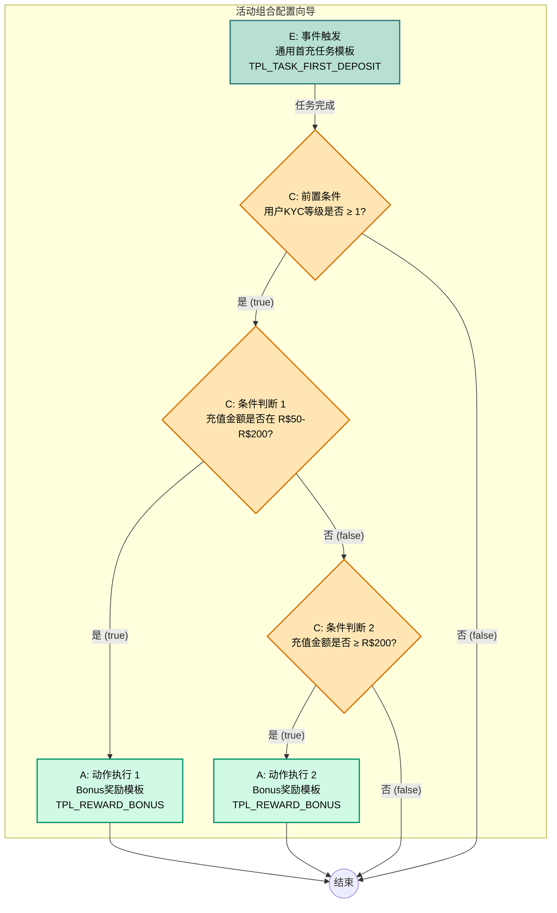

_# XP通用活动平台设计验证案例 (巴西博彩版)_

**版本:** 2.1
**日期:** 2026年1月19日
**作者:** Manus AI

---

## 1. 验证场景变更

为验证v2.1设计方案，我们将原有的“新用户首充送现金”活动，升级为更贴近巴西体育博彩业务的“**新用户首充送Bonus**”活动。

### 1.1 活动规则描述 (v2.1)

活动面向近期注册且**已完成KYC 1级认证**的新用户。在活动期间内，用户完成个人首次充值，即可根据充值金额获得不同档位的**Bonus**奖励。

- **任务**: 完成个人历史第一笔充值。
- **奖励**: 
    - **档位一**: 首次充值金额在 **R$50 (含) 到 R$200 (不含)**之间，奖励 **R$50 Bonus**。
        - **Bonus规则**: 5倍流水要求，有效期30天，最低赔率1.5。
    - **档位二**: 首次充值金额 **大于等于 R$200**，奖励 **R$200 Bonus**。
        - **Bonus规则**: 3倍流水要求，有效期30天，最低赔率1.5。

所有Bonus在用户完成充值后**自动发放**到其红利钱包中。每个用户只能参与一次。

---

## 2. 原子模板设计 (v2.1)

- **任务模板**: `TPL_TASK_FIRST_DEPOSIT` 保持不变，其通用性足以应对此场景。
- **奖励模板**: 我们不再使用现金红包模板，而是使用新设计的 `TPL_REWARD_BONUS` 模板。

---

## 3. ECA 逻辑配置 (v2.1)

一线运营在“活动组合配置向导”中搭建的逻辑流与此前类似，但配置的参数和节点类型发生了变化。

### 3.1 逻辑流程图 (LogicFlow)

### 3.2 节点配置详解 (v2.1)

| 节点类型 | 节点实例 | 配置详情 |
| :--- | :--- | :--- |
| **条件 (Condition)** | `C0: KYC校验` | - **逻辑**: `user.kyc_level >= 1`。该逻辑用于前置过滤，确保只有完成身份认证的用户才能获得奖励。 |
| **动作 (Action)** | `A1: 发放R$50 Bonus` | - **模板**: `TPL_REWARD_BONUS` - **配置**:    - `红利金额`: 50   - `流水倍数`: 5   - `有效期(天)`: 30   - `最低赔率`: 1.5 |
| **动作 (Action)** | `A2: 发放R$200 Bonus` | - **模板**: `TPL_REWARD_BONUS` - **配置**:    - `红利金额`: 200   - `流水倍数`: 3   - `有效期(天)`: 30   - `最低赔率`: 1.5 |

---

## 4. 测试目标与数据追溯 (v2.1)

测试目标需要全面升级，以验证Bonus的完整生命周期。

### 4.1 C端用户运行流程测试 (v2.1)

| 测试用户 | 用户行为 | 预期系统表现 |
| :--- | :--- | :--- |
| **用户A (符合档位一)** | 1. 注册，完成KYC 1级认证。 2. 首次充值 **R$100**。 | 1. 充值成功后，**红利钱包**收到 **R$50 Bonus**。 2. 用户可在“我的红利”页面看到该笔Bonus，及其流水要求（R$250）、进度（0/250）、有效期。 |
| **用户B (完成流水)** | 1. (接用户A) 进行多次有效投注（赔率>1.5），累计投注额达到 **R$250**。 | 1. “我的红利”页面中，该笔Bonus的流水进度变为 **250/250**。 2. 该笔Bonus的状态变为`COMPLETED`，其剩余金额（假设为R$50）**自动转入用户主钱包**，变为可提现现金。 |
| **用户C (未完成KYC)** | 1. 注册，未完成KYC认证。 2. 首次充值 **R$100**。 | 1. 充值成功后，**无任何奖励**发放。 |

### 4.2 数据存储与可追溯性验证 (v2.1)

| 验证项 | 目标数据表 | 需核对的字段与值 |
| :--- | :--- | :--- |
| **发奖账本** | `reward_ledger` | - **用户A**: 应新增一条记录，`reward_type`为`BONUS`，`reward_amount`为`50`。   - `reward_meta`字段必须包含`{"wagering_multiplier": 5, "validity_period_days": 30, ...}`的完整快照。 |
| **红利钱包** | `user_bonus_wallet` | - **用户A**: 应新增一条记录，`user_id`为'user_A'，`bonus_amount`为`50`，`wagering_requirement`为`250`，`status`为`ACTIVE`。 - **用户B**: 在完成流水后，该记录的`status`应变为`COMPLETED`，`completed_wagering`应为`250`。 |
| **资金流水** | (内部账本，未在本文定义) | - **用户B**: 在Bonus状态变为`COMPLETED`时，必须有一笔从“平台支出账户”到“用户A主钱包”的内部转账记录，金额为Bonus的剩余价值。 |

通过这个更复杂的案例，我们可以验证v2.1设计方案不仅能够支持博彩业务的特殊奖励类型，还能完全满足其严格的合规和数据追溯要求。
